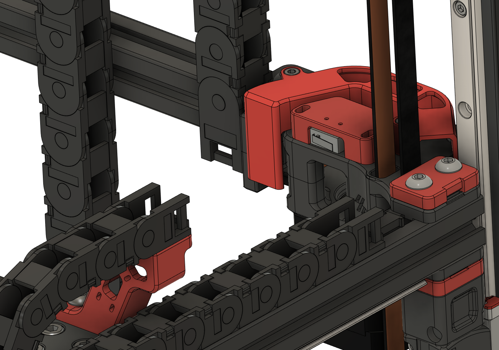

# voron-parts
Just some other custom parts I've made that probably aren't worth making a pull request over.

Almost all of these files are works in progress, they may break your printer and set your house on fire, so use at your own risk etc.

[Actual mods by me](https://github.com/VoronDesign/VoronUsers/tree/master/printer_mods/richardjm)  
[WLED Moonraker](https://moonraker.readthedocs.io/en/latest/configuration/#wled)  
[Voron 2.4 backup and links](https://github.com/richardjm/voronpi-klipper-backup)  

# [Quick release latch for 2020](voron-2.4/FilamentLatch)

# [Chunky 0.1 skirt with power](voron-0.1/ChunkyPowerSkirts)

# [Frame mounted 0.1 endstop](voron-0.1/FrameXEndstop)
Requires some filing for 0.1 pcb

# [Front keystone for 2.4](voron-2.4/KeystoneSkirt)

# [No drill mounts for 0.1](voron-0.1/ElectronicsMounts)

# [AY endstop for 2.4 - untested](voron-2.4/AYEndstop)
Relocation for https://github.com/hartk1213/MISC/tree/main/Voron%20Mods/Voron%202/2.4/Voron2.4_GE5C

# Others
- [Simple hinge for 2.4](voron-2.4/SimpleHinge)
- [CerealBlowers](voron-2.4/CerealBlowers)

discord: whistlinric
