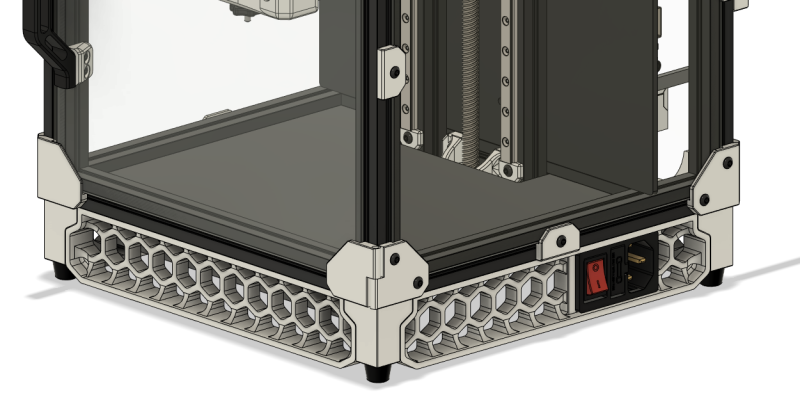
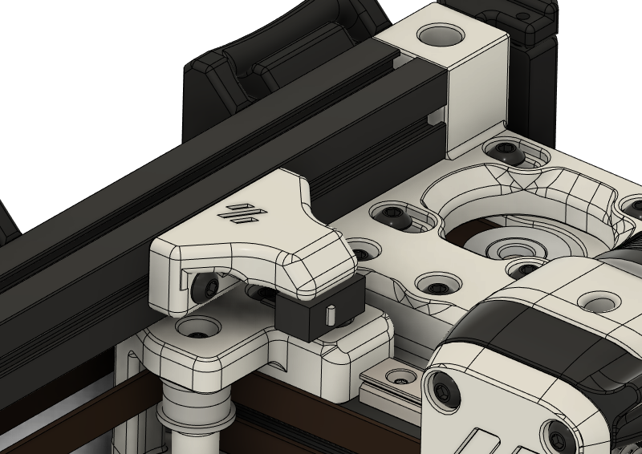
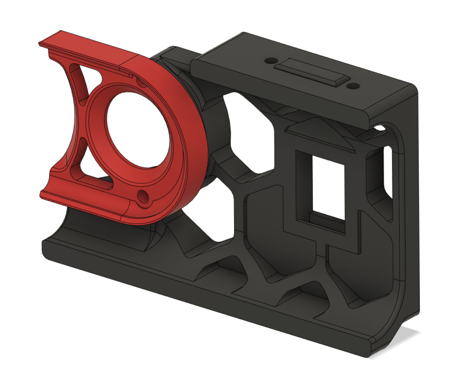
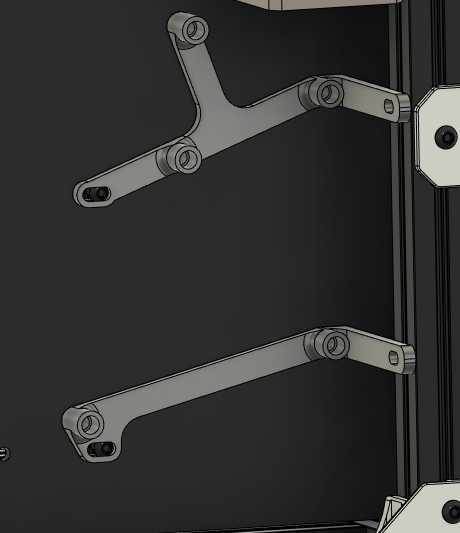
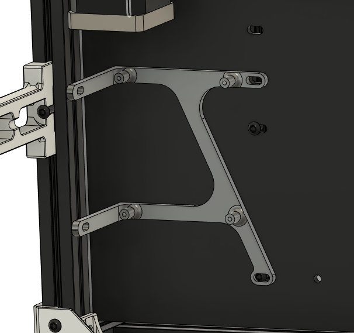

# voron-parts
Just some other custom parts I've made that probably aren't worth making a pull request over.

Almost all of these files are works in progress, they may break your printer and set your house on fire, so use at your own risk etc.

[Actual mods by me](https://github.com/VoronDesign/VoronUsers/tree/master/printer_mods/richardjm)  
[WLED Klipper Module](https://github.com/richardjm/klipper/blob/richardjm/wled-module-requests/klippy/extras/wled.py)  
[Voron 2.4 backup and links](https://github.com/richardjm/voronpi-klipper-backup)  

