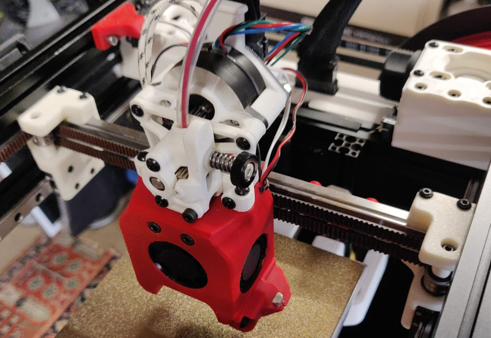
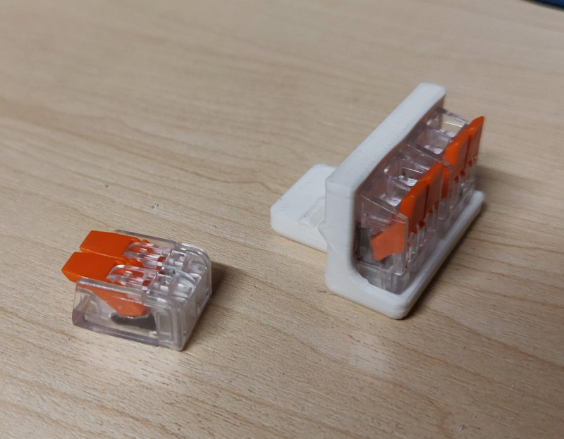
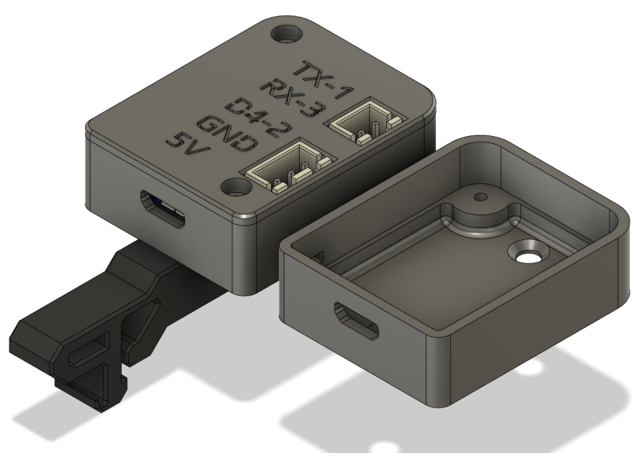
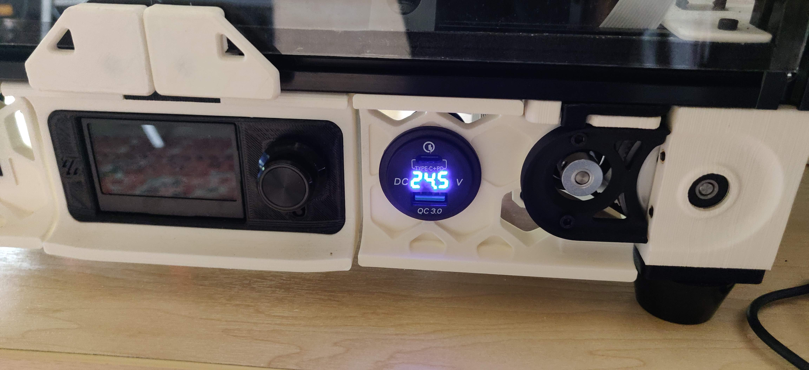
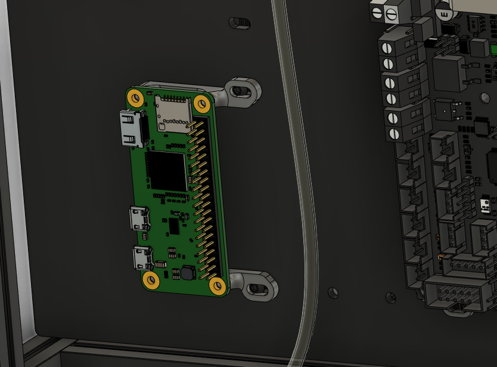
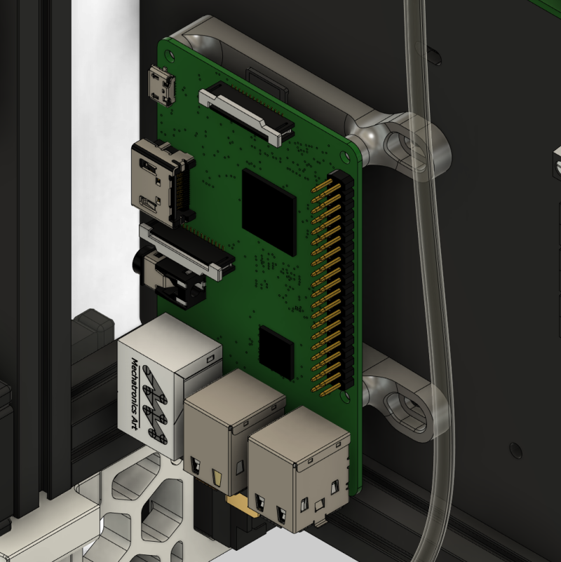
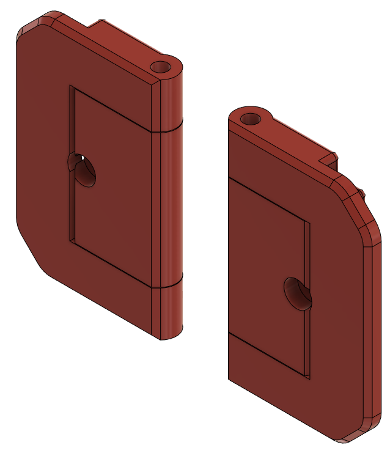

# voron-parts

*If you like or print these please considering liking or adding a make to printables -
https://www.printables.com/social/64622-richard-m/about*

Just some other custom parts I've made that probably aren't worth making a pull request over. (discord: whistlinric)

Almost all of these files are works in progress, they may break your printer and set your house on fire, so use at your own risk etc.

["Official" mods by me in VoronUsers](https://github.com/VoronDesign/VoronUsers/tree/master/printer_mods/richardjm)  
[WLED Moonraker](https://moonraker.readthedocs.io/en/latest/configuration/#wled)  
[Voron 0.1 backup and links](https://github.com/richardjm/voron0pi-klipper-backup)  
[Voron 2.4 backup and links](https://github.com/richardjm/voronpi-klipper-backup)  

# [Quick release latch for 2020](voron-2.4/FilamentLatch)
## [Now on VoronUsers as Snap Latch 2020](https://github.com/VoronDesign/VoronUsers/tree/master/printer_mods/richardjm/snap-latch-2020)

# [Quick release latch for 1515](voron-0.1/FilamentLatch)

# [Mgn12c for 0.1](voron-0.1/Mgn12c)

# [Mgn9h for 0.1](voron-0.1/Mgn9h) (untested)

# [DFH inspired clone wago mounts for 0.1](voron-0.1/DFHInspiredCloneWagoBedMount)

# [WLED Controller Box](generic/wled_controller_box)

# [LED clip in mount for 0.1](voron-0.1/LedClipInMounts)

# [SparkFun Thing Plus Din Mount](voron-2.4/SparkFunThingPlus)

# [Chunky 0.1 skirt with power](voron-0.1/ChunkyPowerSkirts)

# [Frame mounted 0.1 endstop](voron-0.1/FrameXEndstop)
Requires some filing for 0.1 pcb

# [Front keystone for 2.4](voron-2.4/KeystoneSkirt)

# [Usb Charger 2.4](voron-2.4/UsbChargerSkirt)

# [No drill mounts electronics for 0.1](voron-0.1/ElectronicsMounts)

# [AY endstop for 2.4](voron-2.4/AYEndstop) (untested)
Relocation for https://github.com/hartk1213/MISC/tree/main/Voron%20Mods/Voron%202/2.4/Voron2.4_GE5C

# [Simplish hinge for 0.1](voron-0.1/SimplishHinge)

# [Simple wide opening hinge for 2.4](voron-2.4/SimpleHinge)

# Others

- [CerealBlowers](voron-2.4/CerealBlowers)
