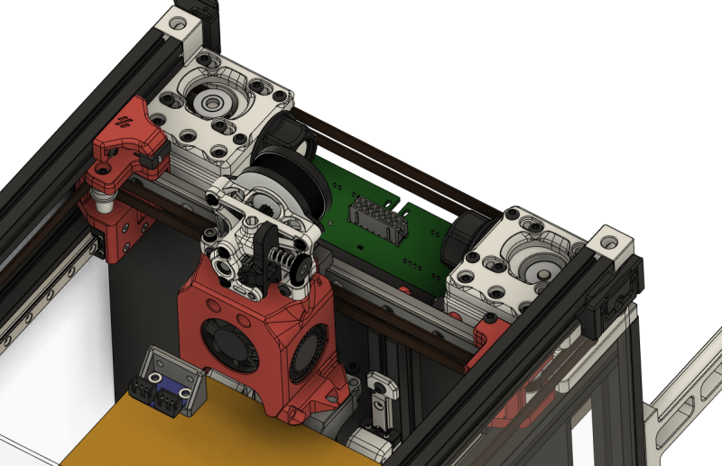
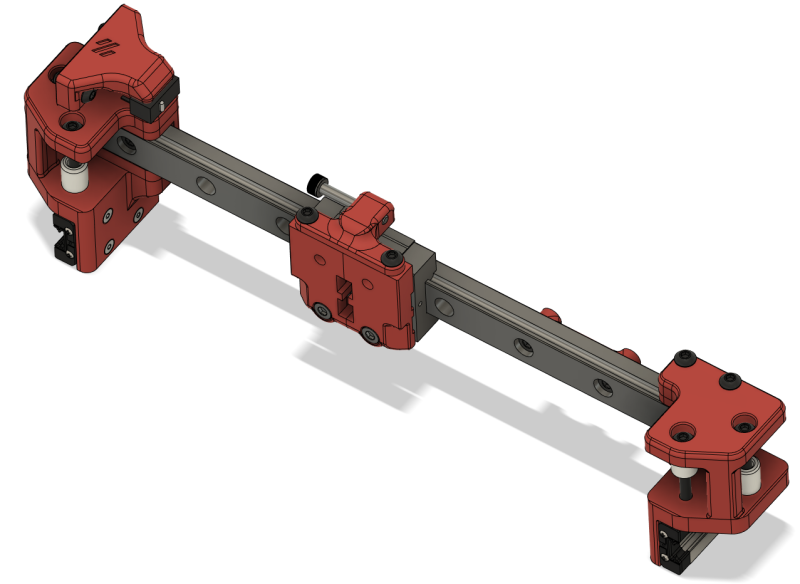
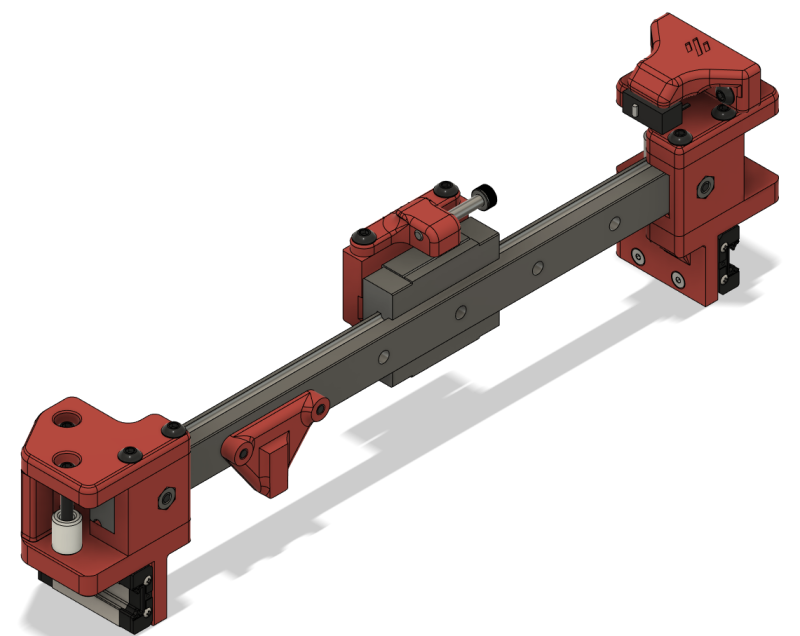
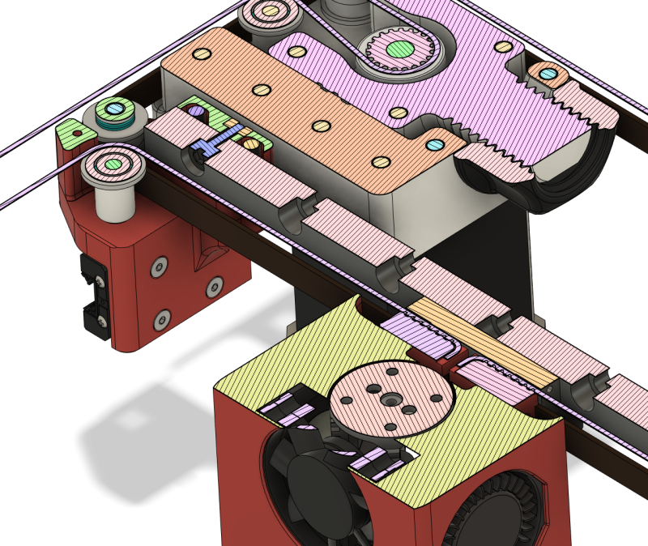

# Mgn12c x-rail for voron 0.1
An idea to replace the x-extrusion and mgn7h rail with a lone mgn12c rail.

## Why
- Wanted to see if moving the carriage to the front helps with ridgity
- Changed to a heavily modified trident carriage to clamp the belts
- Used a [mini after sherpa extruder](https://github.com/KurioHonoo/Mini-AfterSherpa) as the hole spacing for mini-ab didn't want to gel with the mgn12c rail
- Klicky for both z-endstop and screw tilt adjust
- Modified after sherpa klicky cowling, more space for belts, different holes for mgn12c, tighter tolerances on klicky probe I found I needed
- But primarily because I'm a tinkerer

## Status
- Printed and fitted to my v0.1
- Subsequent change to m3x35 bolts to hold cowling (untested)

## BOM
This is all from the cad and memory so it may be wrong

### Rail
- Mgn12c 200mm rail

### Left right joints
In addition to reusing parts from previous joints you will need the following
- 8 heatset inserts
- 2 m3 nuts
- 2 m3x8 shcs
- 4 m3x30 bhcs

### Cowling and carriage
Your fans, motor, etc from your mini-ab
- 4 heatset inserts
- 2 m3x35 shcs
- 2 m3x6 shcs
- [mini after sherpa extruder](https://github.com/KurioHonoo/Mini-AfterSherpa)
- [klicky for 0.1](https://github.com/jlas1/Klicky-Probe) (not cowling)

### X-endstop and bumpers
Microswitch and m2 screws from original carriage
- 2 m3x10 (x-endstop)
- 2 m3 nuts (x-endstop)
- 1 m3x20 (x-bumper)
- 2 m3x6 shcs (x-bumper)
- 2 m3x8 (y-bumper)

## Likely issues
- Reduced hot-end airflow
- Heavier
- Rail guides are exactly the size of the mgn12 rail - should there be some allowance?
- Had to move the X idlers 1mm forward to create space for the rail support bolts

## Bodges
- Ugly end-stop bumpers
- The m3x30 rail support bolts protrude creating tight clearance with the relocated x-endstop
- X-endstop is relocated to the rail (update your [homing](https://github.com/richardjm/voron0pi-klipper-backup) routines)
- Multiple minor cad cleanups to cowling (e.g. extra room for belt surplus)

Discord: Whistlinric