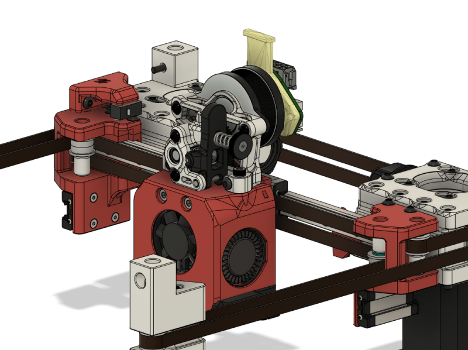
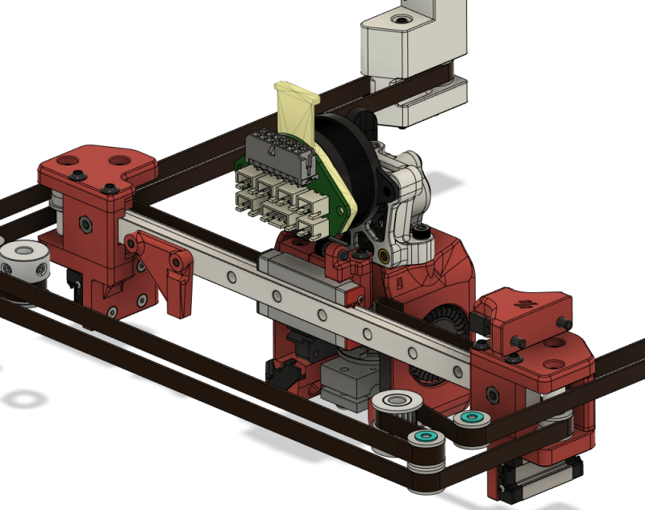

# Mgn9h x-rail for voron 0.1
An idea to replace the x-extrusion and mgn7h rail with a lone mgn9h rail.

## Status
- CAD only variant of the [mgn12c](../Mgn12c) currently fitted to my 0.1

## BOM
This is all from the cad and memory so it may be wrong

### Rail
- Mgn9h 200mm rail (medium preload)

### Left right joints
In addition to reusing parts from previous joints you will need the following
- 8 heatset inserts
- 2 m3 nuts
- 2 m3x8 shcs
- 4 m3x30 bhcs

Discord: Whistlinric