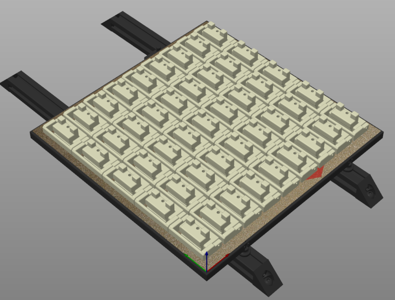

# Latch for panels on 2020 extrusion

This is originally inspired by a youtube video - [https://www.youtube.com/watch?v=6p7M18oPn3k](https://www.youtube.com/watch?v=6p7M18oPn3k)

Another user is creating cad and variants - [https://github.com/v6cl/My-Voron2.4-Customs/tree/main/Panel_Locker](https://github.com/v6cl/My-Voron2.4-Customs/tree/main/Panel_Locker)

## So why did you do it?

1. I wanted a variant with filament hinges
1. I found it didn't put quite enough pressure on the panel and my attempts to moodify the cad failed
1. Decided the best way to understand it was to design it
1. Wanted adjustable "pressure" and thought using a sweep on the latch was a nice solution making the most of the flex of ABS
1. Wanted everything as a parameter so I could tune it
1. Build plate density, a bonus using a filament hinge is that the area used for each hinge is much smaller

## Hardware
- 3mm-6.5mm - m3x12
- 7.0mm+ - m3x16

## The process

1. Cad attempt one failed, just modified surfaces to create a filament variant but adjustement beyond that failed
1. Cad attempt two failed, created a traced version copying the dimensions but again couldn't get a reliable adjustment
1. Cad attempt three of the cad sketch made as built was finally onto something, took until v45 before I had something that seemed to fulfil my requirements, then after thinking overnight revisited earlier designs and finally hit RC at v68 (18 actually printed)

## Parameters

- Panel depth
- Squish
- Sweep pressure
- Nut gap - drop-ins or hammer nuts (19mm or 12mm)
- Pin width
- Hinge clearance
- Hinge arm width
- Pivot diameter - with work this could be an m3 and heat set hinge
- Pad size
- Bistate height - only change this if you want to experiment

Changing these parameters to extremes may either not work or require fixups of chamfers and fillets.

Once done, adjust the build plate view (use top view to ensure clearance) and save the file as mesh.

