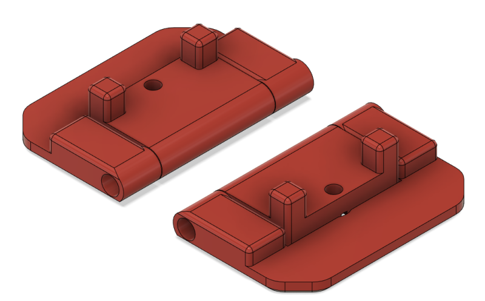

# Wide opening simple hinge for 2.4

Very simple design similar in appearance to the originals. Requires an m3x50 for the hinge and fits total panel depths (sheet + foam) of 4 or 5 mm.

Optional m3 heatset insert or just leave the bolt loose for easy removal

