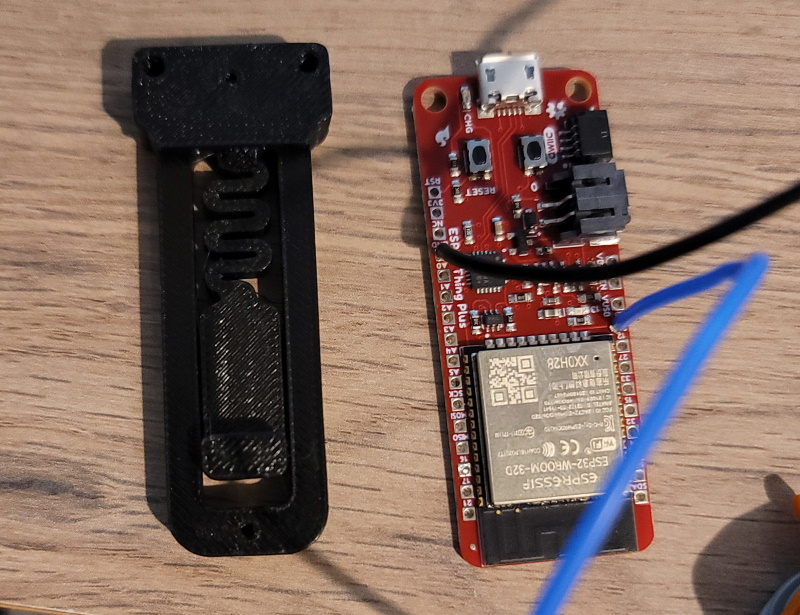

# Quick and dirty SparkFun Thing Plus Din mount

The din mount is adapted from [Voron 2.4](https://github.com/VoronDesign/Voron-2/blob/Voron2.4/STLs/VORON2.4/Electronics_Compartment/DIN_Brackets/pcb_din_clip_x3.stl) - GPLv3

## Who
discord:whistlinric for discord:JJG