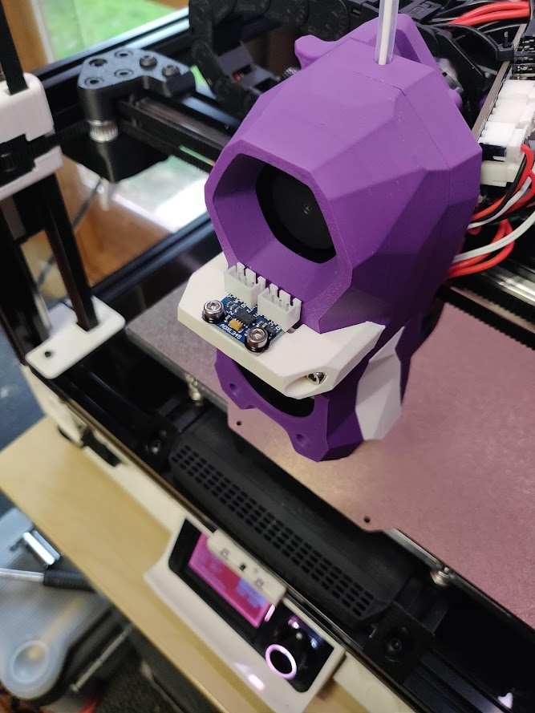

# StealthBurner ADXL GY-291 mount

## 🚮 - Beta5

## Hardware
- GY-291 + connectors (I use jst-xh)
- 2 * m3x50
- 2 * m3x6
- 2 * heatset insert
- 2 * plastic washer

Seems to work and give [sensible results](https://github.com/richardjm/voronpi-klipper-backup/blob/master/resonances/shaper_calibrate_x-2022-02-13-16_05_56.png)

