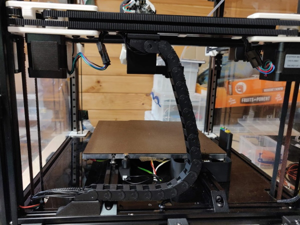
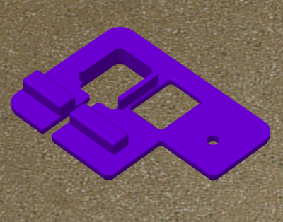
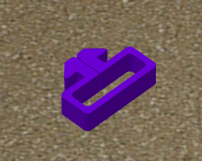
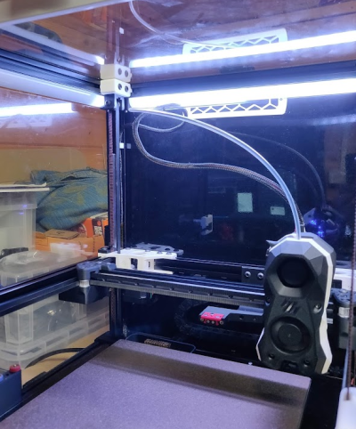

# Undermount z chain using Klicky

*If you like or print these please considering liking or adding a make to printables -
https://www.printables.com/model/279739-voron-can-bus-z-chain-move*

Using the [Klicky Probe](https://github.com/jlas1/Klicky-Probe) mount 
as the upper support for the z chain making use of the smaller chain from
the x or y gantry.

- X or Y gantry chain
- M5 roll-in and bolt
- M3 roll-in and bolt

## Front View

## Rear View

## Other useful STLs

## For reference by Can Bus route
